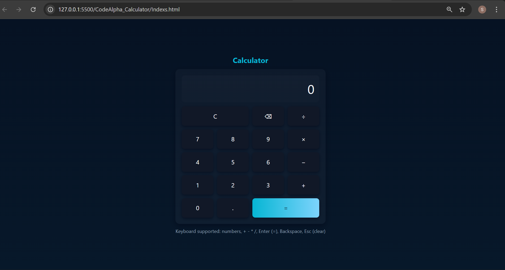

# CodeAlpha Internship - Task 2: Calculator

This is a simple, responsive calculator built using **HTML, CSS, and JavaScript**  
for the **Frontend Development Internship at CodeAlpha**.

### 🔧 Features
- Clean UI with dark theme
- Keyboard support (numbers, + - * /, Enter, Backspace, Esc)
- Real-time calculation
- Error handling
- Responsive design

### 📂 Project Structure
index.html  
styles.css  
script.js  

### 🚀 Live Demo
[Live Demo](https://shubham-coder-a.github.io/CodeAlpha_Calculator/)

### 📸 Screenshots
()

### 👨‍💻 Intern: Shubham Raju Nagpure  
Student ID: CA/DE1/7143  
Domain: Frontend Development
